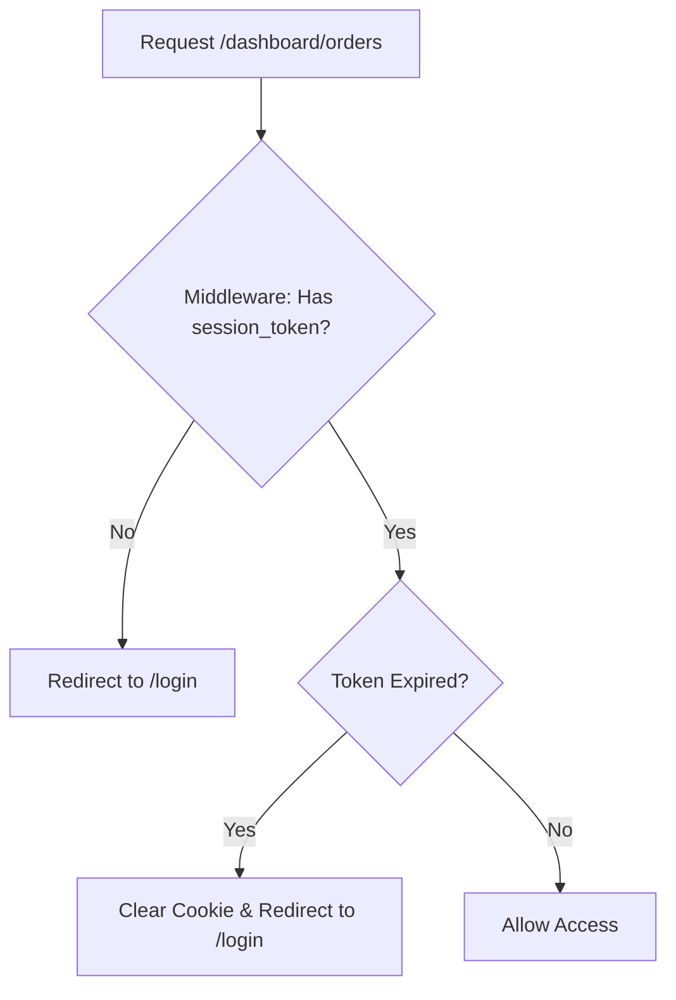

# Architecture and Flow

This document explains the technical structure and operation of the **XII Tel 13 Pre-order Automation** project.

## Directory Structure

| Directory | Purpose |
| :--- | :--- |
| `src/app/` | Main application folder (Next.js App Router). |
| `src/app/(public)/` | Open-access routes (Landing, Login, and Order Creation). |
| `src/app/(dashboard)/` | Protected routes for administrative management. |
| `src/app/api/` | Serverless backend functions handling logic and DB interactions. |
| `src/components/` | Reusable UI components (buttons, cards, forms, etc.). |
| `src/lib/` | Utility functions, Supabase client initialization, and core logic. |
| `src/hooks/` | Custom React hooks for shared functionality across components. |
| `docs/` | Comprehensive technical and user documentation. |

## Data & Logic Flow

### 1. Order Process

- **Step 1 (Customer)**: Browses products on the landing page (`/`).
- **Step 2 (Selection)**: User clicks "Order Now" on a product card.
- **Step 3 (Submission)**: Data is sent to the `/api/create-order` endpoint.
- **Step 4 (Database)**: The order is recorded in the Supabase database.
- **Step 5 (Feedback)**: On success, a toast notification confirms the order.

### 2. Administrator Access

- **Login**: Admin enters credentials at `/login`.
- **Token Generation**: Upon successful login, a Base64-encoded JSON `session_token` cookie is created.
- **Middleware Check**: For every request to `/dashboard/*`, the `middleware.ts` verifies the session token and its expiration.
- **Dashboard Load**: If validated, the admin is granted access to the dashboard.

### 3. Dashboard Management

- **Orders**: Admin views all pending and completed orders at `/dashboard/orders`.
- **Products**: Admin can update stock levels, prices, or add new products.
- **Dynamic Updates**: Uses React state and API calls to keep the UI in sync with the database.

## Authentication Logic (Simplified)

